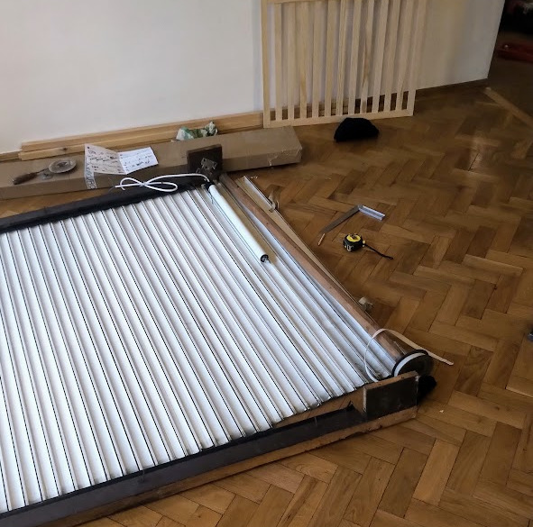
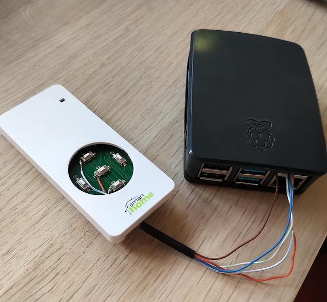

# Smart home system

DIY hobby project to develop own solution for IoT devices around my apartment.

## Kewords
- Android, WebView
- Go (Go lang)
- Vue.Js, Vuetify
- Raspberry Pi
- Firebase hosting
- MQTT
- Websocket

## Key concept
With this system you can control physical devices with a simple Android app.
This setup is not depend from any cloud based provider.

I renovated my old shutter to a controllable solution. I chosed the "Smart-Home" engine. https://www.smart-home.hu/smart35r6

I got simple remote controller with three integrated push buttons. I disassembled it and after a quick soldering it has been
attached to the GPIO ports of Raspberry. 

I implemented a program in GO to control the shutter. Thanks to https://github.com/stianeikeland/go-rpio it was extreamly simple.

The plan was that to control my shutter from any where and later extend the system with light bulb control, thermostat control and etc.
So I builded a pure web interface in Vue.js and I upload the code into Firebase hosting.  For the better user experience I created an
Android application. With it I can load the web UI.

Currently the center of network communication is my Raspberry Pi with Mqtt server.
